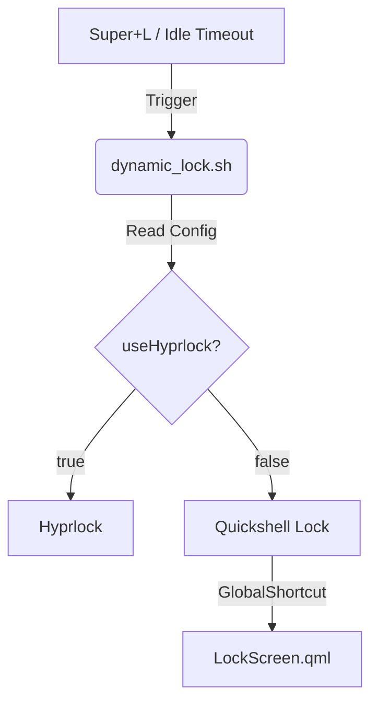

# Dynamic Lock Screen Configuration

This setup allows switching between **Hyprlock** and **Quickshell Lock** dynamically based on `~/.config/illogical-impulse/config.json`.

## Architecture



## Configuration Files

| File | Purpose |
|------|---------|
| `config.json` | Contains `"useHyprlock": false` setting |
| `hypridle.conf` | Calls `dynamic_lock.sh` on timeout |
| `keybinds.conf` | Calls `dynamic_lock.sh` on `Super+L` |
| `dynamic_lock.sh` | Logic script to choose lock screen |

## Critical Logic Note

The script uses `jq` to parse the boolean value.
**Start Command:**
```bash
USE_HYPRLOCK=$(jq -r '.lock.useHyprlock | if . == null then true else . end' "$CONFIG_FILE")
```
> **Note:** We must use an explicit `null` check because `jq`'s `//` operator treats `false` as "empty", which would incorrectly default to `true`.

## Troubleshooting

If lock screen always defaults to Hyprlock:
1. Check `config.json` syntax
2. Ensure `jq` is installed
3. Verify script permissions (`chmod +x dynamic_lock.sh`)
